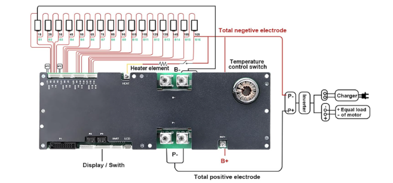
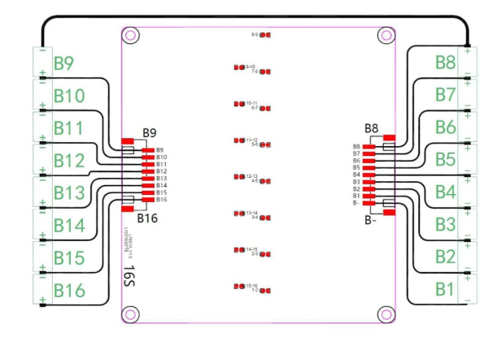

12/1/2025

## Goal / Why
1.Commercial Production
- The strong trend for DIY battery module
- https://www.youtube.com/watch?v=aH5Y_gJXOsI&t=226s
- Build your own home solar battery backup!

2.Open Source Community (Energy IoT)

3.Innovation Development
- SMB disruptive BMS  
- As the development base for SMB (ORES/DEGCent)

## Phase One Prototyping / How
1.With JK（极空）BMS Home Energy Storage BMS, 1A Active Balance

- https://www.amazon.com/JKBMS-Inverter-8S-16S-24V-48V-Built/dp/B0FHPN6KTQ/ref=sr_1_4?crid=1GF9MKU5099AR&dib=eyJ2IjoiMSJ9.F9M1ckcHrVk23OIYpxB0ZbczuvPo4ugIVpxV7-QrjfuJOD5n30pdxMxLXWTIWFMEjmGwGWURzAjJtdUscE6_KN3kuxgmsCbaT_owNpOZtIFu_sr-2c3_E4v8jXzXgTeI9jHd8ZEXkvUF7edCcoQkhH80ICU1aLZ-Pzaz63rezdkmp6LR9oBYPbFa1xzwMOUeKZgzdye8x3mE1eu8zkiGjPW2zYwQom0z9fUujEV7lbE.BXcc4C9ttAG-SamEuKj3XIqWm0PYZ0CERGDKVHQnjTM&dib_tag=se&keywords=16s%2Bbms%2Blifepo4%2B48v&qid=1764473567&sprefix=%2Caps%2C131&sr=8-4&th=1

2.Libre BMS+1.2A Active BMS Balancer

- https://github.com/LibreSolar/bms-c1

- https://www.amazon.com/Lifepo4-Equalizer-Balancer-Inductive-Transfer/dp/B09C3J5TN3/ref=sr_1_14?crid=1GF9MKU5099AR&dib=eyJ2IjoiMSJ9.F9M1ckcHrVk23OIYpxB0ZbczuvPo4ugIVpxV7-QrjfuJOD5n30pdxMxLXWTIWFMEjmGwGWURzAjJtdUscE6_KN3kuxgmsCbaT_owNpOZtIFu_sr-2c3_E4v8jXzXgTeI9jHd8ZEXkvUF7edCcoQkhH80ICU1aLZ-Pzaz63rezdkmp6LR9oBYPbFa1xzwMOUeKZgzdye8x3mE1eu8zkiGjPW2zYwQom0z9fUujEV7lbE.BXcc4C9ttAG-SamEuKj3XIqWm0PYZ0CERGDKVHQnjTM&dib_tag=se&keywords=16s%2Bbms%2Blifepo4%2B48v&qid=1764473567&sprefix=%2Caps%2C131&sr=8-14&th=1

## 3 Way Collaboration / Proposal
1.Prototyping (ORES/DEGCent), current, in about one month
- Total ESS
- Testing bed
- Using JK BMS
- 16 LFP cells
- 2kW inverter
- Charger

2.Software/Embedded/Firmware + Core Hardware base (Libre BMS) , in about months

3.Demo System (Energy IoT), in about half year

4.Comercial production, in about one year
- CA, USA

## 4 Planning and Milestone
1.BOM ready, Feb 2026
- BMS
- Cells
- Out door cabinet
- Inverter
- Charger

2.POC, April 2026
- Fundamental integration with EMS
- Libre BMS bug fix support
- Attend the Climate Week demo
- May have no communication with inverter 

3.Further Development and Testing, August 2026
- Communication with inverter

