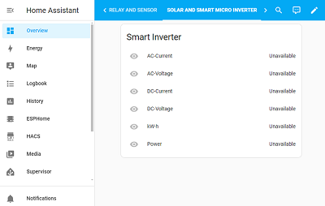
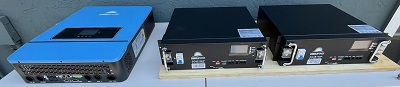
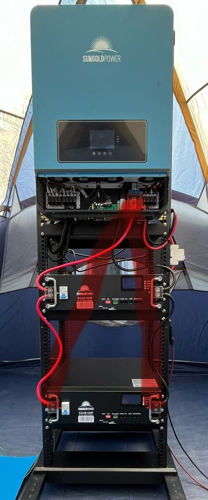
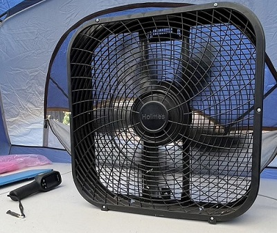

# Reference Implementation

## LF Energy Summit 2024 Presentation
1. Speaker (**Solution/Standardization**): The Future of Energy with Open Renewable Energy Systems (ORES)
- Problem driven Standardization.
- Disaggregate and Smart Panel (Generation vs Consumption, View vs Control).
- Home Grid: Microgrid for Smart Home, Downsize Grid Technologies. 
- Layers: Device, Platform, Application.

2. Project Demo (**Implementation**): Open Renewable Energy Systems (ORES) 
- Development setup:
  - Home Assistant and ESPHome based
  - Real Time Remote Browser Access
  - China Setup
  - California Setup
- Home Assistant Dashboard
  - 
  - Home Assistant Sensor & Relay
  - 
  - Home Assistant Solar Microinverter
  - 
  - Solar Microinverter Voltage
  - 
  - Solar Microinverter Current
  - 
  - Solar Microinverter Power
  - 
  - House Power Total
  - 
- Production Setup with Third Party Kit
  - Solar Panel
  - 
  - Battery, Hybrid Inverter
  - 
  - Rack
  - 
  - Safety with temperature control
  - 
  - Operating Video
  - 
- On site AC Battery demo box.
  - 
3. Panel (**Future/Innovation**): Introduction to AC Battery Based ESS Disruptive Innovation "Energy Router" Initiative
- SMB: Multilevel Modular PCS.
- Safer, Lower Cost, Higher Efficiency.

## Existing technology and vendor solution integration
Refer to Devices_Integration_Prototyping.md
- Application: for various energy management flexibility applications.
- Devices: for third party devices integration.
- Platform: smart home energy solution platform. 
- images: image and their source files.

## Energy Router: AC Battery / Smart Modular Battery Based New Technology Innovation Initiative
Refer to Energy_Router_Prototyping.md
- eRouter Product Box Assembly Front View  
  - 
- eRouter Product Box Assembly Bottom View  
  - 
- eRouter Product Box Front View
  - 
- eRouter Product Box Top View
  - 
- eRouter Product Box Bottom View
  - 
- Todo: Induct, Protection, Control Power, Terminal, The Big Bba File.
