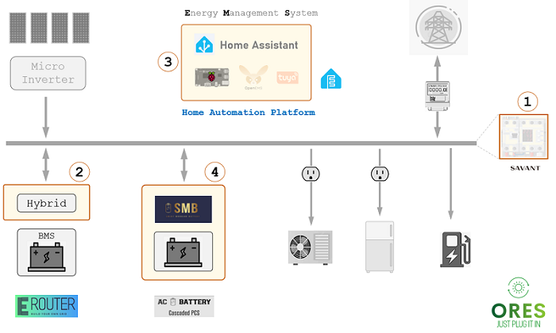

# Home Grid Standardization Initiative

1. **Home Grid & Smart Panel**
- Grid tie system with **current source** type device (classic grid following) feature.
- Off grid system with **voltage source** type device (cutting edge grid forming) feature.
- **Switch and transition** between grid tie and off grid mode.
  - The off grid system runs as the load of the grid for charging purpose.
  - Manual switch
 
2. **Communication Protocols & Devices Integration** 
- Develop adapter code to integrate various new energy devices.
 
3. **Application Automation & Software Defined EMS**
- Support various flexibility patterns and control types

4. **AC Battery Technology Based Energy Router** 
- Hardware Interface between Power Conversion Module and Control Plane.
- Software Interface between Cascaded PCS/SMB and PCS Control System.
- Equalization by Cylinder, Module, and Cell.
