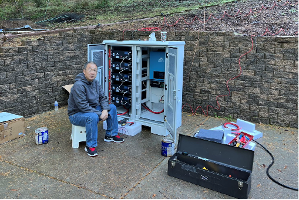
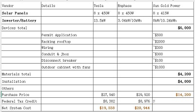
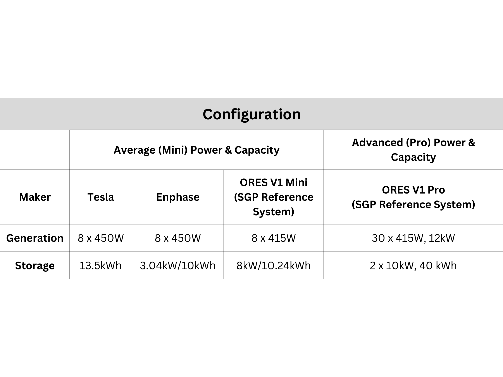
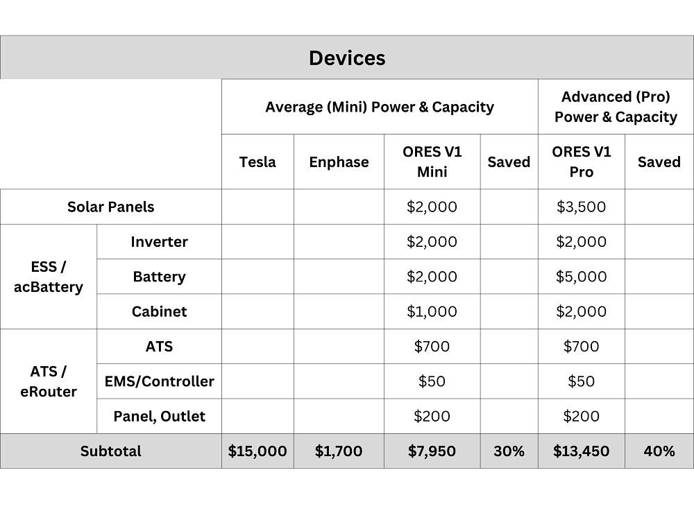
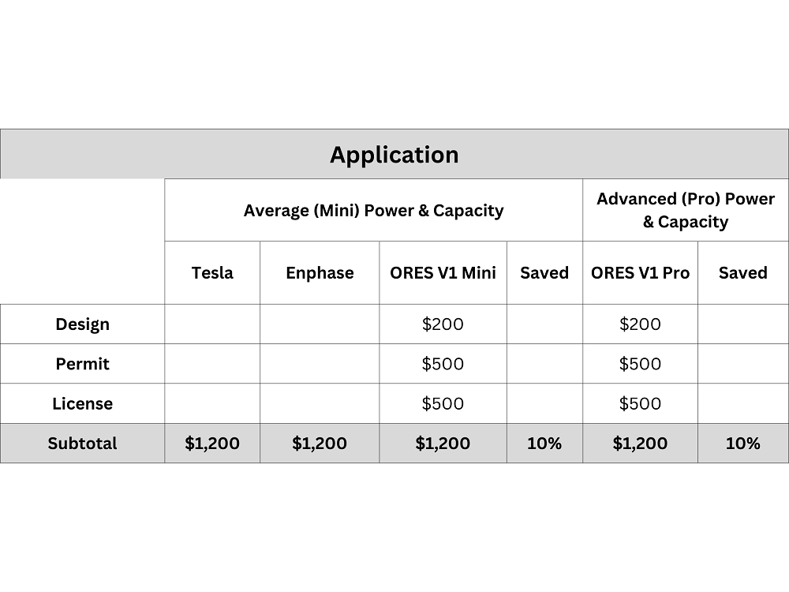
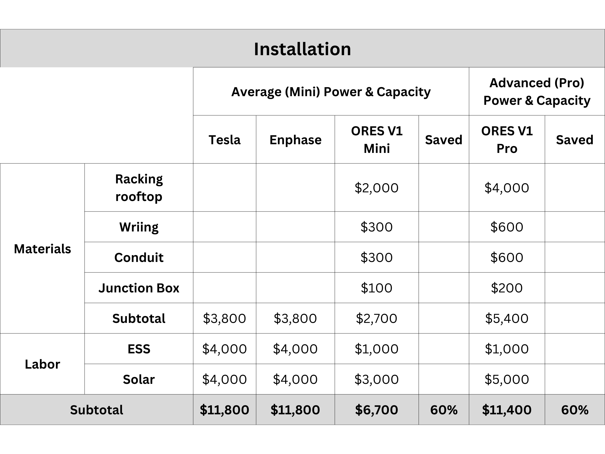
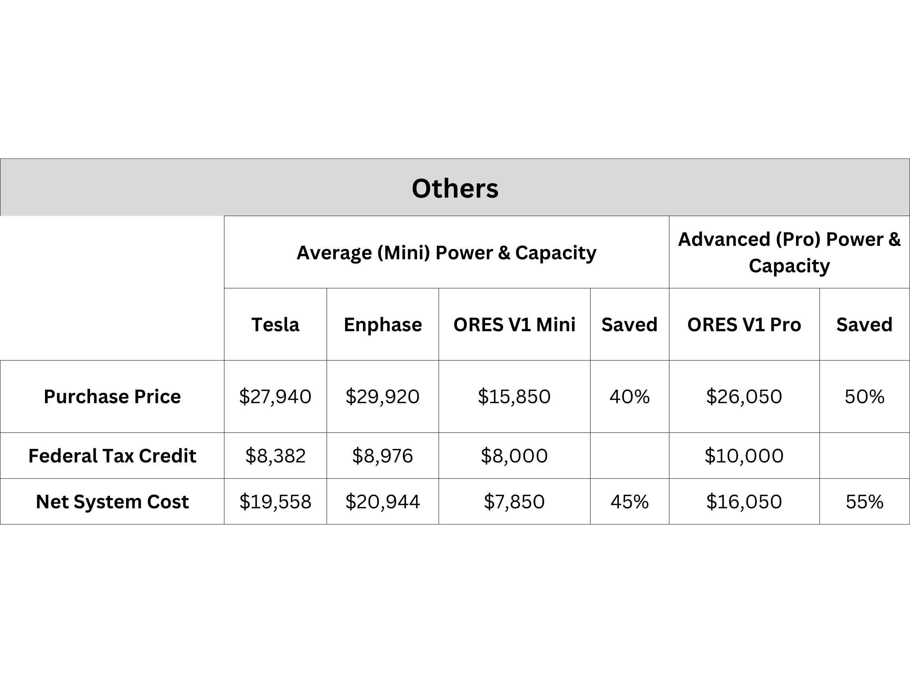

# Some recent findings to share.

- **Observation:** Based on our recent demo systems' deployment experience and estimated cost analysis of some major vendors with the similar spec, we found the value differences are significant, for both devices cost and especially installation labor cost.
- Demo system deployment.
  - 
- Cost analysis.
  - 
  - 
  - 
  - 
  - 
  - 
  
- **Actions:** For an open and standardized DIY plug and play system, we have below aspects to address:
  - Hardware device level: energy AC battery cabinet, energy Router ATS, ESS device technology innovation. The standardized cabinet is the key value proposition in between device manufactures and home owners for current installation deployment. 
  - Compatible communication and interconnection between devices and controller within the system, "Energy IoT".
  - Software Defined EMS, various application scenario policy enforcement, to implement S2.
  - System installation deployment, safety monitoring and operation maintenance.
  - Battery on-line, off-line safety and performance evaluation and analysis.
