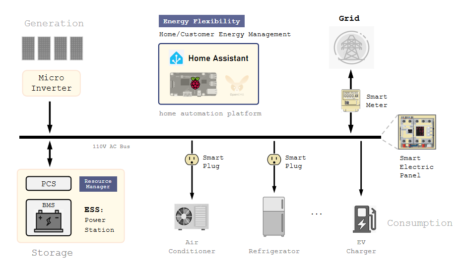
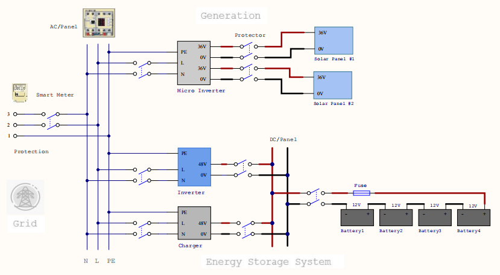
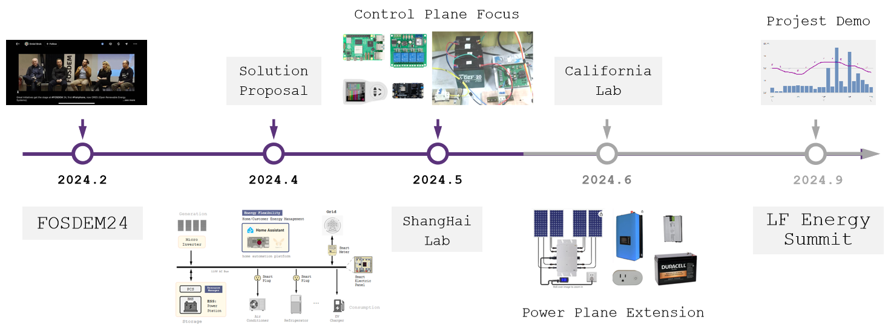

# Hardware Devices Integration Prototyping (Tentative)

## Background

1. Goal
- Evaluate, setup, and run corresponding platform/framework open source project.
- Evaluate, integrate vendors' devices.
- Identify problem statements bottom up from ORES detailed design perspective.
2. Scope and Condition
- For residential, house, home energy management for the current phase. 
- Start from specific requirement first. 
3. Design and Implementation Iteration Phases
- Hardware devices from major vendor, energy optimization implementation between generation, storage, and consumption, with in a house (supercharge solar).
- Hardware devices from multiple vendors, with in a house.
- Optimization with grid-tie (time-based control, VPP), between houses.

## Prototyping System Diagram

## Energy Power Plane (perspective)

1. **Generation**: Mainly the solar panel with micro inverter. Current typical configuration is one micro inverter (2kW) with 4 solar panels (500W each).
2. **Storage**: Either all-in-one “device centric”solution, like portable power station, or the “system centric” one consists of battery module with BMS(Battery Management System), PCS(Power Conversion System), ie. ESS(Energy Storage System). The former is more convenient to install, but the communication with external might not be fully supported. The latter has better communication support with external, especially with EMS. This ESS is the major part of the concern of the prototyping.
3. **Consumption**: Some appliances can communicate with home automation platform. Others may not, in this case, we need smart plug to collect information from.
4. **Grid**: In order to feed power energy back to grid, it is necessary to meet regulations, to get qualification. Under most condition for the time being, we may need to limit the power energy feed back to grid.
5. **Smart Electric Panel**: Mainly the AC bus is represented here, one of the major important pieces of the system.
6. **Smart Plug, Smart Meter**: To collect appliances and house power energy related data information. To make the system easier and better to do energy management and optimization.

## Control and Management Plane (perspective)

1. Home Automation Platform/Framework
- Home Assistant: Active open source project，implemented with Python，on Raspberry Pi. Support Matter, Zigbee, Thread, etc. From user’s standpoint, the most of its beauty is its “software defined” or “intent based” feature. For home EMS，the home automation platform might be the most fundamental part.
 - OpenEMS: implemented with Java, started by FENECON GmbH.
 - Amazon Alexa, Apple HomeKit, Google Nest, etc.
2. Communication Standard: Zigbee, Matter, Thread, S2.
3. Integration and Add-on: For Home Assistant, Integration are pieces of software to connect to other software and platforms. Add-ons provide additional functionality, for example, to extend S2 Resource Manager functionality.
3. Automation and Script: Automation in Home Assistant allow you to automatically respond to things that happen. Similar to automation, scripts are repeatable actions that can be run. For the prototyping, we may utilize these primitives to implement those basic energy flexibility scenario.

## Energy Flexibility Scenario

1. Supercharge Solar: Utilize the energy generated by solar as much as possible.
2. Time-based Control: Optimize the energy usage based on the time duration price of the power utility, save money as much as possible.
3. S2: eight flexibility patterns, and five control types.

## Problem Statement (bottom up) 

Within the context of the prototyping phase#1 plan and implementation, since we will base our prototyping on the home automation platform, we can leverage those mechanism already there, it may not need to implement much. Mainly two aspects of problems are expected to develop solution and implementation so far, to describe with S2 terms here.
1. With Resource Manager (RM): An adaption layer abstraction and standardization between the CEM (standard) communication protocol and the lower layer (inner, propriety) protocol of different ESS devices.
2. With Customer Energy Manager (CEM): Abstraction, and standardization to support those energy flexibility scenario by implementation.

## Phase#1 Implementation

1. Hardware Devices (vendor, spec, protocol/api, cost, etc.)
- Solar Panel
- Micro Inverter
- Battery Module with BMS
- PCS or Power Station
- Electric Panel
- Smart Plug and Smart Meter
- Raspberry PI
- Accessories
2. Software Development
- Data collection, monitor and analysis
- Devices adaption, resource manager with ESS
- Scenario automation and script
3. System Integration, Testing and Operation
  
## Progress Update

June 12th, 2024

1. Main focus of the fundamental prototyping system setup in Shanghai lab is with the control plane part based on Home Assistant, including Raspberry Pi, smart meter/plug, voltage and temperature sensors, switch/relay, etc. The power plane experiment is relative preliminary, mainly ESS with separate inverter and charger configuration.
2. For California lab  setup, the target is to extend the power plane part. First is 1-4 solar panels about 400W each, with micro inverter  around 1-2kW outdoor better with WiFi. The second is the ESS with lead acid battery at the beginning for safety reason, and with the power limiter for the inverter, WiFi support required. 
3. Use US standard instead for smart meter/plug, accessories, etc. 
4. For bidirectional AC power flow detection, the voltage sensor is required in addition to the current sensor, since the direction is calculated by the phase difference. We met some issue with some smart power meter.  It works well with its app, it needs to have direction indication with Home Assistant as well.
5. For current setup we use the AC couple solution for simplicity reason, it means we need two separate inverters. We plan next version or setup to be able to use DC couple solution (solar MPPT battery DC charger) as well. 

