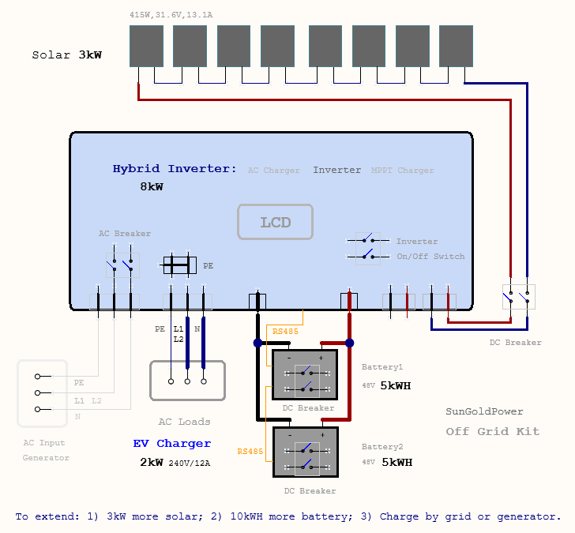

# Vendors' Kits Evaluation

## SunGoldPower, 2024-08-23

1. **The Kit**
   - Off-Grid Solar Kit 8000W 48VDC 120V/240V LifePo4 10.24KWH Lithium Battery 8 X 415 Watts Solar Panels
   - https://sungoldpower.com/products/off-grid-solar-kit-8000w-48vdc-120v-240v-lifepo4-10-24kwh-lithium-battery-8-x-415-watts-solar-panels-sgr-8k10e?gad_source=1&gclid=Cj0KCQjwsuSzBhCLARIsAIcdLm6sxmwi9g3GgTIcpTyADAkzXtL3KBy4b-EfUvwdEKpPcPJ3DVqQ4wYaAqNPEALw_wcB

2. **Installation**
   - 

   - Follow the YouTube video: https://www.youtube.com/watch?v=EO_ngtckK24
     - 08 L16   # Battery Type: 16 series of LFP batteries (USER, SLD, FLD, GEL, N13/N14, NOb)
     - 32 485   # Communication Function: 485 (SLA, CAN)
     - 33 PYL   # BMS Communication: Pylontech (PACE, Ruida, Aoguan, Oliter, Sunwoda, Daqin, SRNE, Vilion)

   - In addition, Setting Change to Fix the issue of "Inadequate outlet charging”: 
     - 63 ENA # Auto N-PE Connection Switch Function: ENA Enable (Disable)

   - For Information:
     - 68 AC output phase mode # 180 (default) represents the split-phase mode
   
3. **EV Charging**
   - Mostly regulated by the residential 12A/32A current max for Tesla Model 3.
     - One phase 120V is about 12A/1kW charging power.
     - Split phase 240V is about charging 32A current / 7kW power limit.

4. **Brief Cost** (USD)
   - Kit: $6000
   - Accessories: $1000
   - Installation: $2000
   - License and Permit application if using grid AC input for charge: $1000 (and the procedure takes time)  
   - Total: $7900 if considering 30% tax return for hardware purchase

5. **Initial Value Proposition Analysis**
   - For ESS (Energy Storage System), two batteries (48VDC 100AH each) can hold up to 10kWH energy with an active capacity of 8kWH.
   - Solar power generates an average at 5 hours per day, varying from 0-3 hours during winter to 6-8 hours during summer，for a total of about 15kWH per day. Therefor, solar power can fully charge the ESS and provide an extra supply for home usage during summer, but may not be enough to charge the ESS during winter or rainy seasons.
   - Energy Generation per Day：3kW x 5Hours = 15kWH
   - Value Generated per Day: 15kWH x $0.51/kWH = $7.6
   - Value Generated per Year: $7.6 x 365 = $2800
   - About **3 years** ROI (Return Of Investment).

## Enphase，(To Do)  

- https://enphase.com/homeowners
