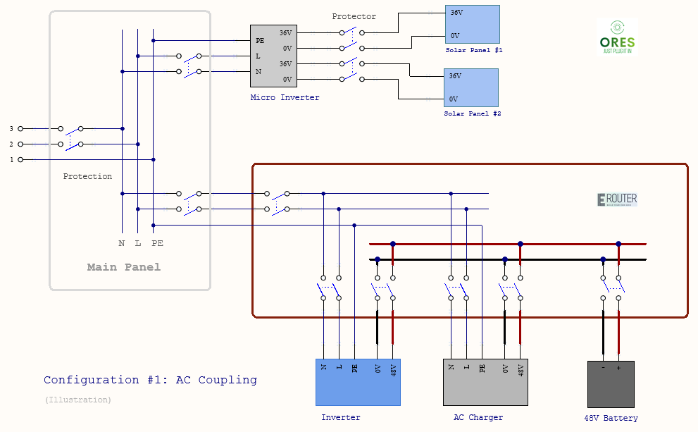
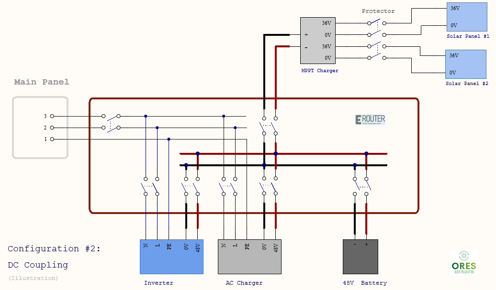
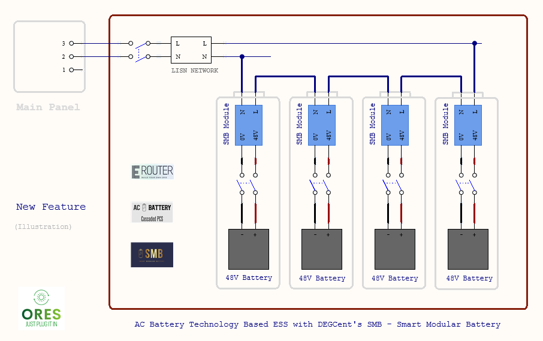

# Energy Router Prototyping (Initial)

## Specification: Energy Router and Architecture (value proposition)

In addition to the **Open Standardization** for the current mainstream production, we propose the next generation **AC Battery** (Cascaded PCS) technology-based disruptive Home Grid integration system with the concept of **Energy Router** as the fundamental architecture and implementation solution. We will provide more architecture updates with specification section.

1. Power Plane (Energy Distribution)

- Major features for power plane are AC coupling, DC coupling, hybrid, and AC Battery technology based. We can combine and configure these features together as Energy Router Model for various scenario. For example, if solar is too far we use AC coupling; if it is closer and more powerful, we can use DC coupling hybrid. It supports both off grid and grid tie applications. We can use grid utility to charge off grid system if solar doesn't generate enough.
- Split Phase: Specific for US Application. 
- Off Grid, Grid Tie, and "Grid Forming": Current off grid system solution has an AC input for battery charging from grid. It is treated as a kind of grid load. Similarly, the off grid can be a generator for the grid. We call it a coupling of DC battery. The eventual general solution is probably the grid tie system, where the energy flow between is controlled by the EMS. We use the grid forming solution as the reference model for the interaction between the home grid and the utility grid. 

2. Control Plane (SDER - Software Defined Energy Router)
- Disaggregate: compared with proprietary hybrid product solution. 
- Distributed: not only devices, but also smart plug sensors and switches. 
- Centralized: information and management mechanism with the CCU.
- Multiple Layers: one is at system wise CCU, the other is at smart device

## Fundamental Configurations

1. AC Coupling

2. DC Coupling

3. Hybrid：AC Coupling + DC Coupling

## AC Battery Technology Based Next Generation ESS

## Prototyping for off grid, hybrid, outdoor.

- Use resister for device capacitor charge when connecting battery first time to avoid sparks.
- Central air conditioner with soft starter for surge capacity.

