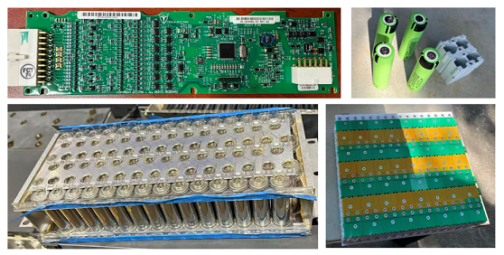
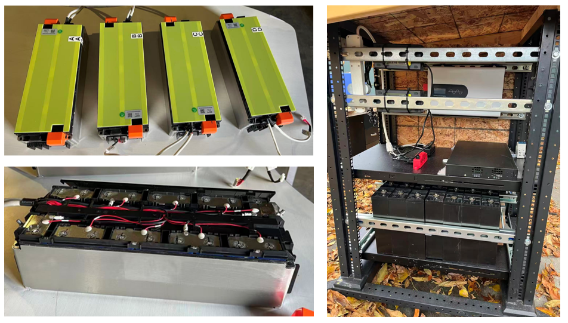

2026-05-07

## Working progress update

- EV 18650 battery & Tesla Roadster BMB (Battery Monitor Board)，https://github.com/teslamotors/roadster

- Storage LFP battery & testbed setup

2026-01-17

For active load balancing, refer to https://github.com/DoganM95/CN3302-ETA3000-2S-Charger-Balancer

## Brief Analysis of Libre BMS Firmware
- main: the main thread mainly responsible for core Battery Management System functionality.
- data_objects: ThingSet implementation for handling external communication and data mapping.
- bms.h: BMS high-level API with the context information struct bms_context.
- bms_ic.h: API for BMS front-end ICs with struct bms_ic_driver_api.
- button: this device/driver implements 3-second long-press detection via interrupt.
- leds: this device/driver manages charge/discharge bms/status indicators via a dedicated thread.
- oled: this device/driver handles real-time bms data visualization via a dedicated thread.

- Q: Which OLED device should I use/buy?
- A: In theory, one with ssd1306 should work. However, it would share the i2c bus with the BMS AFE, so I'm not sure if I would really use it.
- Q: The funtion for communication with external (laptop) is by Zephyr/ThingSet?
- A: Yes, ThingSet over serial or CAN. Or just use the mobile phone app. ThingSet App is available in the Android store. Apple is not yet supported.
