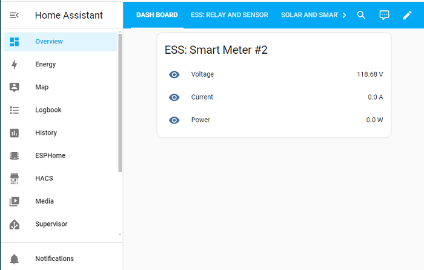
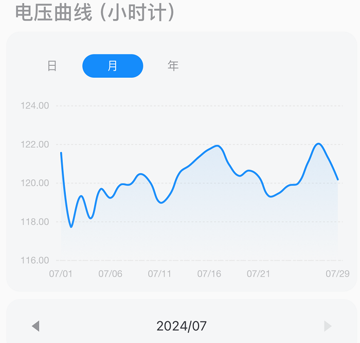
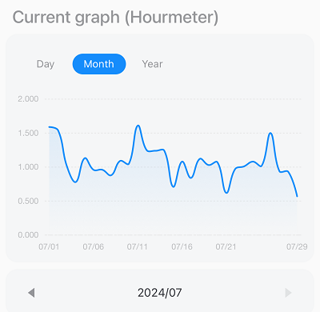
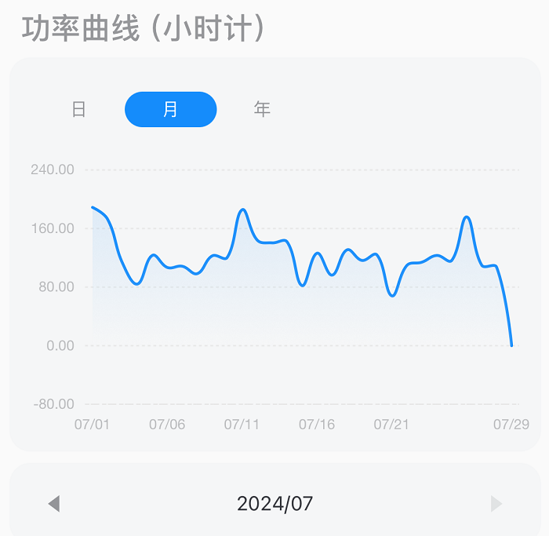
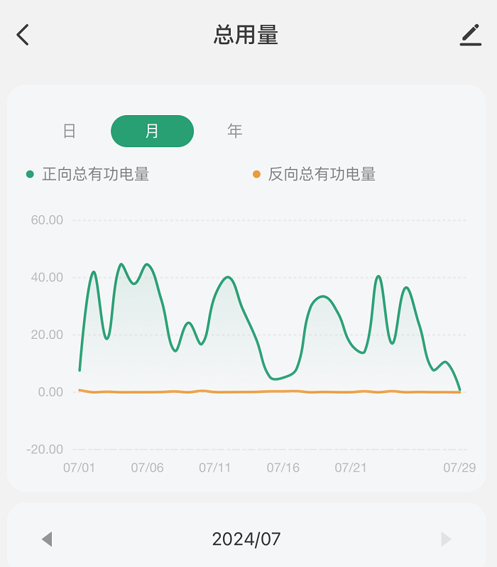
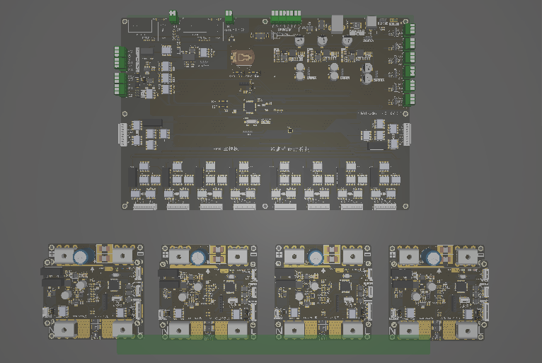
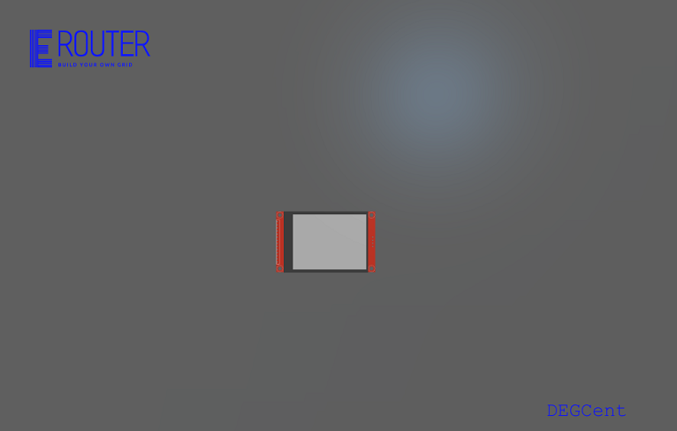
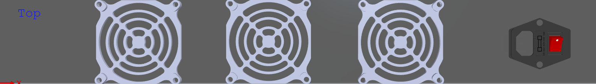
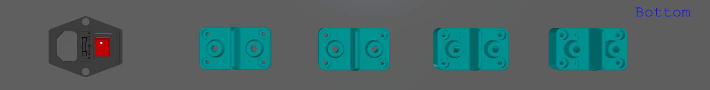

# Reference Implementation

## LF Energy Summit 2024 Presentation
1. Speaker (**Solution**): The Future of Energy with Open Renewable Energy Systems (ORES)
- Standardization, problem driven.
- Dis-aggregate, Smart Panel (generation vs consumption, view vs control).
- Home Grid: microgrid for smart home, grid technologies down sizing. 
- Layers: device, platform, application.

2. Project Demo (**Implementation**): Open Renewable Energy Systems (ORES) 
- Development setup, based on Home Assistant and ESPHome, real time remote browser access, one setup in China another in California.
  - Home Assistant Dashboard  
    
  - Home Assistant Sensor & Relay  
    
  - Home Assistant Solar Micor Inverter  
    
  - Solar Micor Inverter Voltage  
    
  - Solar Micor Inverter Current  
    
  - Solar Micor Inverter Power
    
  - House Power Total
    
  - todo：revise, with English.
- Production setup with third party kit, short video.
- On site AC Battery empty box. how to ship to the summit?

3. Panel (**Future**): mainly introduce the AC battery based ESS disruptive innovation "Energy Router" initiative
- SMB: Multilevel modular PCS.
- Better safety, lower cost, higher efficiency.

## Existing technology and vendor solution integration
Refer to Devices_Integration_Prototyping.MD
- Application: for various energy management flexibility applications.
- Devices: for third party devices integration.
- Platform: smart home energy solution platform. 
- images: image and their source files.

## Energy Router: AC Battery and Smart Modular Battery based new technology initiative
Refer to Energy_Router_Prototyping.md
- eRouter product box assembly front view  

- eRouter product box assembly bottom view  

- eRouter product box front view

- eRouter product box top view

- eRouter product box bottom view

- Todo: conduct, protection, control power, terminal, the big mba file.
