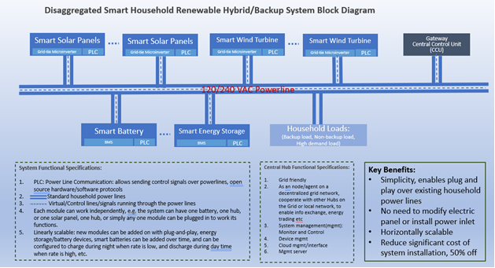

# Open Renewable Energy Systems (ORES): Functional Specification, Architecture, and APIs 

## Background
Open Renewable Energy Systems (ORES)  is a follow-up endeavor that stems from the insights of the LF Research whitepaper  ["The Open Source Opportunity for Microgrids: Five Ways to Drive Innovation and Overcome Market Barriers for Energy Resilience."](https://www.linuxfoundation.org/research/open-source-opportunity-for-microgrids)  In light of the considerable potential for open source solutions in areas such as Microgrids, Virtual Power Plants, and Distributed Energy Resources, the inception of ORES includes designing a power network topology, block diagrams, functional requirements, and core design principles. 

## Objective
ORES aims to develop an open standard architecture, API, and protocol for renewable energy systems, initially for residential use cases. This project seeks to provide an open alternative to  the dominance of proprietary black box energy solutions and promote a more open, innovative, and collaborative approach in the renewable energy sector.

## Problem Statement

The residential renewable energy sector is currently hindered by several key issues:

1. **Prohibitive Costs**: The high cost of equipment, installation, and permitting presents a significant barrier to the widespread adoption of renewable energy systems.
2. **Proprietary Black Box Solutions and Vendor Lock-in**: The market is largely dominated by proprietary and black box solutions, notably from major industry players, leading to a lack of transparency, limited consumer choice, and hindered innovation.
3. **Lack of Open Solutions and Standardized Architecture**: According to the [research report](https://www.linuxfoundation.org/research/open-source-opportunity-for-microgrids), there is a significant need for open solutions in this area to foster innovation, expand consumer options, and challenge the dominance of proprietary systems. Additionally, there is a notable lack of standardized architecture for interoperability.
4. **Complex System Setup and Retrofitting Requirements**: The difficulty in building, configuring, and operating home energy systems, coupled with the need to retrofit existing home electrical systems to accommodate new systems.

4. **Regulatory and Integration Hurdles**: Complex regulations and opaque interfaces with utility grids are major obstacles to the adoption of open renewable systems and DIY solutions.

## Description

ORES is designed to overcome these challenges by creating a suite of straightforward, open standard specifications. These specifications cover system architecture, APIs, and communication protocols, enabling device manufacturers, hardware and software developers, as well as DIY enthusiasts, to create their own disaggregated, user-friendly, and plug-and-play renewable energy solutions. Initially targeted for residential applications, there is potential for expansion into commercial and industrial scenarios in the future. Additionally, ORES aims to explore opportunities in areas like Virtual Power Plants (VPP), renewable energy marketplaces, and more, thereby broadening its scope and impact.

## Functional Specification and Key Characteristics of an ORES System

The ORES is designed for efficiency, flexibility, and smart integration. It combines modular design, real-time monitoring, and advanced energy management features.

### Key Characteristics

- **Flexibility and Adaptability:** Adapts to different environments and user requirements with its modular and scalable design.
- **Resilience and Reliability:** Ensures continuous energy supply even in off-grid scenarios.
- **Efficient Management and Control:** Intelligent energy allocation and monitoring for optimal energy usage.
- **User Empowerment:** Simplified installation and operation, reducing the need for specialized expertise.
- **Sustainability and Cost-Effectiveness:** Focus on renewable energy and smart energy management for long-term benefits.

### Specifications

1. **Plug-and-Play Capability**
    - Easy integration with existing wiring systems.
    - User-friendly installation and configuration.

2. **Disaggregated System**
    - Modular, autonomous components.
    - Centralized management through a hub unit.
    - Network interaction for grid services and demand response.
    - Independent operation capability (Island Mode).

 3. **Scalability**
    - Flexible adjustment of components based on energy needs.
    - Customizable capacity to meet specific requirements.

 4. **Real-Time Monitoring**
    - Tracks energy usage and savings.
    - Provides insights for informed energy management.

 5. **Remote Control of Appliances**
    - App-based control for connected devices.
    - Automated operation scheduling for energy efficiency.

 6. **Automatic Energy Allocation**
    - Smart Plugs and microinverters for efficient energy distribution.
    - Prioritization of energy use and storage based on peak and off-peak times.

 7. **Matter Smart Home Protocol Integration**
    - Compatibility with leading smart home systems.
    - Seamless integration with a variety of smart devices.

## ORES Architecture, System Components and Modules

The ORES system architecture features a modular, interconnected design for efficient energy production, storage, and management. Below is an overview of its key architectural elements:

 1. **Modular Composition**
    - **Components:** Consists of energy production modules, energy storage modules, and a central control unit (CCU), which can be either physical or virtual (cloud-based).

 2. **Common Interface**
    - **Standardized Connection:** All modules interface with the standard household 120 VAC outlet, ensuring compatibility with home infrastructure.

3. **Power Delivery and Communication**
    - **Distribution:** Power is delivered through internal house power lines.
    - **Communication Channels:** In addition to power lines, modules communicate via Bluetooth, Wi-Fi, or Ethernet.

4. **Standardized Communication**
    - **APIs and Protocols:** Utilizes standardized APIs and open protocols for seamless inter-module communication.
    - **Interoperability Example:** A solar panel from Company A can communicate with a CCU from Company B, which connects to an energy storage module from Company C.

5. **Modular Independence and Operation Modes**
    - **Autonomous Mode:** Each module operates independently, performing basic functions (e.g., a solar panel generating electricity, a battery charging at night and discharging during the day).
    - **Network/Federation Mode:** Modules can join a federation led by the CCU for advanced functions and policy implementation.
    - **Central Hub Role of CCU:** The CCU interacts with external entities like power grid peers or utility companies for broader network functions.

### Summarizing the Key Unique Characteristics of the ORES System

The ORES system architecture addresses major problems in existing solutions with the following unique characteristics:

### 1. Disaggregated System Architecture
- **Modular Components:** 
  - Each module is self-contained, loosely coupled, and independent.
  - Facilitates linear scalability and ease of maintenance.
- **Vendor Flexibility:** 
  - Allows for mixing and matching equipment from different vendors.
  - Reduces system costs and vendor lock-in.

### 2. Standardized on 120/240 VAC Power Lines
- **Ease of Use:** 
  - Connection through standard 120/240 VAC power lines for plug-and-play capability.
  - Simplifies installation and use.
- **Reduced Installation Costs:** 
  - Eliminates the need for electrical system upgrades or retrofitting.
  - Significantly lowers installation and operational costs.

### 3. Standardized Open APIs and Protocols
- **Interoperability:** 
  - Enables modules from different vendors to communicate and interoperate.
- **Promotion of Competition and Innovation:** 
  - Addresses vendor lock-in.
  - Encourages competition among manufacturers.
  - Facilitates rapid development of new capabilities due to its openness.

### ORES Architecture Block Diagram

#### 1. Smart Energy Production Module

The Smart Energy Production Module encompasses renewable energy sources such as solar panels, wind turbines, or hydroelectric generators. Here, solar panels are highlighted as a primary example. Key components of this module include:

- **Renewable Energy Sources:**
  - Includes options like solar panels, wind turbines, and hydroelectric generators.
  - These sources harness natural energy for electricity production.

- **Grid-Tied Microinverter:**
  - A generic grid-tied microinverter is incorporated.
  - Features open API capability, enabling third-party development and integration.
#### 2. Smart Energy Storage Module

The Smart Energy Storage Module includes the following key components and functionalities:

- **Battery System:**
  - High-capacity lithium-ion or lithium iron phosphate (LiFePO4) battery pack.
  - Advanced Battery Management Systems (BMS) for safety and longevity.

- **Inverter/Converter:**
  - High-efficiency DC-AC inverter/converter for usable AC power.
  - Supports bidirectional power flow for charging and discharging.

- **Communication and Control Unit:**
  - Battery Management: Monitors battery State-of-Charge (SoC), State-of-Health (SoH), and temperature.
  - Grid Interaction: Manages grid connection and synchronization.
  - Load Management: Prioritizes power to critical loads during grid outages.
  - Remote Monitoring: Status checks and adjustments via connectivity options.
  - Data Logging: Collects data on energy storage, grid interaction, and performance.

- **User Interface:**
  - For monitoring performance, setting preferences, and configuring operation modes.
  - Includes options like a touchscreen display or a mobile app.

- **Energy Management Algorithms:**
  - Optimizes charging and discharging based on various factors.
  - Prioritizes renewable energy usage and adapts to energy price variations.

#### 3. Central Control Unit (CCU)

The Central Control Unit (CCU) is a software system that can operate locally on a separate control device, or an app on the phone, or in the cloud. It is a major control user interface that manages and optimizes energy flows between components such as solar panels, batteries, grid connections, and loads. Key functions include:

- **Energy Management:**
  - Implements control algorithms for managing energy flow between sources (solar, battery, grid) and loads.
  - Optimizes energy utilization and prioritizes renewable sources when available.

- **Load Management:**
  - Monitors and controls connected loads for efficient energy use.
  - Enables load shedding during grid outages and optimizes load usage based on available energy.

- **Battery Management:**
  - Manages charge and discharge cycles, temperature, and state-of-charge to maintain battery health and longevity.

- **Grid Interaction:**
  - Manages grid connection, including grid-tie inverter functionality and synchronization.

- **User Interface:**
  - Develops a user-friendly interface for monitoring system performance and setting preferences.
  - Facilitates configuration of operation modes.

- **Data Logging:**
  - Collects and stores data on energy generation, consumption, battery state, and grid interaction.

- **Fault Detection:**
  - Implements algorithms for fault detection and triggering appropriate responses.

- **Remote Monitoring:**
  - Enables monitoring and control through a web portal or mobile app.
  - Allows users to check system status and make adjustments remotely.

The CCU can potentially leverage open source solutions such as  [OpenEMS](https://openems.github.io/openems.io/openems/latest/introduction.html), for managing and controlling renewable energy storage and devices.
A Mobile App interface could potentially be developed to add a mobile interface in addition to the browser interface:

Note: explore the interface and APIs that OpenEMS uses to connect to local devices.

## ORES APIs
### Core APIs for ORES System

The ORES system features advanced APIs for microinverters and energy storage, including device self-discovery and connectivity with a local control hub, all accessible via a mobile app interface.

#### Microinverter API
- **Device Identification and Status:**
  - Endpoint: `/microinverter/status`
  - Function: Retrieve operational status and identification details of each microinverter.
- **Energy Production Data:**
  - Endpoint: `/microinverter/energy`
  - Function: Access real-time and historical energy production data.
- **Control Functions:**
  - Endpoint: `/microinverter/control`
  - Function: Remote adjustment of power settings and operational modes.

#### Energy Storage API
- **EnergyStorage Health and Status:**
  - Endpoint: `/energystorage/status`
  - Function: Provides detailed energy storage state-of-charge, state-of-health, and temperature.
- **Energy Storage Data:**
  - Endpoint: `/energystorage/storage`
  - Function: Access real-time and historical data on energy storage levels and usage.
- **Charge/Discharge Control:**
  - Endpoint: `/energystorage/control`
  - Function: Manage charging and discharging cycles remotely.

#### Device Discovery and Connectivity
- **Self-Discovery Protocol:**
  - Endpoint: `/device/discovery`
  - Function: Automates the discovery and integration of new devices in the network.
- **Device Registration and Synchronization:**
  - Endpoint: `/device/register`
  - Function: Registers and synchronizes new devices with the central control hub.

#### Local Control Hub Integration
- **Hub Communication Interface:**
  - Endpoint: `/hub/communicate`
  - Function: Facilitates communication and data exchange between devices and the control hub.
- **System Configuration and Management:**
  - Endpoint: `/hub/configure`
  - Function: Manages system configuration through the control hub.

#### Mobile App Interface
- **Remote Monitoring and Control:**
  - Endpoint: `/app/monitor`
  - Function: Monitor and control the energy system remotely via the app.
- **Notifications and Alerts:**
  - Endpoint: `/app/notify`
  - Function: Sends real-time system notifications and alerts.
- **User Preferences and Settings:**
  - Endpoint: `/app/settings`
  - Function: Adjust user preferences and system settings through the mobile app.

### Common APIs for ORES Devices

In addition to device-specific APIs, the ORES system includes a set of common APIs applicable to all devices, enhancing functionality and security.

- **Firmware Update API:**
  - Endpoint: `/device/firmware/update`
  - Function: Facilitates the remote updating of device firmware, ensuring all devices are up-to-date with the latest features and security patches.

- **Security and Authentication API:**
  - Endpoint: `/device/security/authenticate`
  - Function: Manages device security protocols and authentication processes, ensuring secure communication and access control.

- **Safety and Fault Detection API:**
  - Endpoint: `/device/safety/fault-detection`
  - Function: Monitors devices for safety issues or faults, triggering alerts and actions to mitigate risks.

- **Data Logging and Analytics API:**
  - Endpoint: `/device/data/logging`
  - Function: Gathers and stores operational data from devices, facilitating detailed analysis and insights into system performance.

- **Remote Diagnostics API:**
  - Endpoint: `/device/diagnostics/remote`
  - Function: Enables remote troubleshooting and diagnostics of devices, aiding in efficient maintenance and problem resolution.

These common APIs play a critical role in maintaining the overall integrity, performance, and security of the ORES system.

## Integration with Home Automation and Smart Devices 
Integration with higher level smart services: Google, Alexa, Siri etc for smart controls

## Localized/On-device AI Services - Self-healing, Self-diagnosis, and Autonomous Operation Mode
Some AI/ML data analytics can be performed on the smart phone mobile app or a CCU to be able to analyze the past performance data such as charging, discharging to identify potential performance changes in energy production, storage, and consumption. For example, the data analysis may be helpful to uncover a faulty solar panel or microinverter which exhibits degrating performance over time, exhibiting the behavior as a self-healing power network. It may also give suggestions on usage patterns and automatically configure the system for optimal energy efficiency.
## Future Directions of ORES
### 1. Virtual Power Plant Specification (VPP):
  A VPP can be understood as a cloud-based, distributed power plant that aggregates the capacities of heterogeneous DERs across multiple locations. These resources can include solar panels, wind turbines, energy storage systems, and even flexible power consumers. By leveraging advancements in IoT, AI, and blockchain technologies, a VPP dynamically orchestrates these resources to supply electricity to the grid in a way that mimics a traditional power plant but with greater flexibility and scalability.
  
  The implementation of standard interfaces in VPPs within the ORES project would likely involve several key components:

  - Open Standards and Protocols: Adopting widely recognized standards and protocols for communication and data exchange among DERs and between DERs and the grid. Examples include the use of OpenADR, IEC 61850, or SunSpec for solar inverters.

  - APIs for Integration and Services: Developing Application Programming Interfaces (APIs) that allow for the easy integration of DERs into the VPP ecosystem and the creation of value-added services, such as dynamic pricing, demand response, and predictive maintenance.

  - Security and Data Privacy: Ensuring that the standard interfaces incorporate strong security protocols to protect against unauthorized access and data breaches, while also respecting the privacy of participants.

  - Collaborative Development and Governance: Engaging a wide range of stakeholders, including technology providers, utility companies, regulatory bodies, and end-users, in the development and governance of these standards to ensure they are inclusive, equitable, and reflective of the needs of all parties involved.

### 2. Decentralized Energy Market Specification
    
A Decentralized Energy Market (DEM) Specification outlines the framework for a market where energy generation, distribution, and consumption are decentralized, leveraging small-scale renewable sources. Key components include:

- Market Structure and Participants: Involves a diverse range of actors including producers, consumers, and prosumers, supported by intermediaries like aggregators.

- Technology and Platform: Utilizes blockchain or other distributed ledger technologies for secure, transparent transactions, and smart contracts for automation, alongside IoT for real-time asset integration.

- Standard Interfaces and Protocols: Ensures interoperability among diverse energy resources through common communication standards.

- Regulatory and Legal Framework: Establishes supportive policies for energy trading, grid access, and addresses contracts and liability issues.

- Pricing and Financial Mechanisms: Implements dynamic pricing based on supply and demand, facilitated by digital currencies or tokens.

- Security, Privacy, and Trust: Emphasizes robust cybersecurity measures, data privacy protections, and transparent operations to build trust.

- Energy and Grid Management: Integrates with grid operations for reliability and includes mechanisms like demand response for grid stability.

- Social and Environmental Goals: Aligns market operations with broader objectives like increasing renewable energy use and ensuring equitable access.